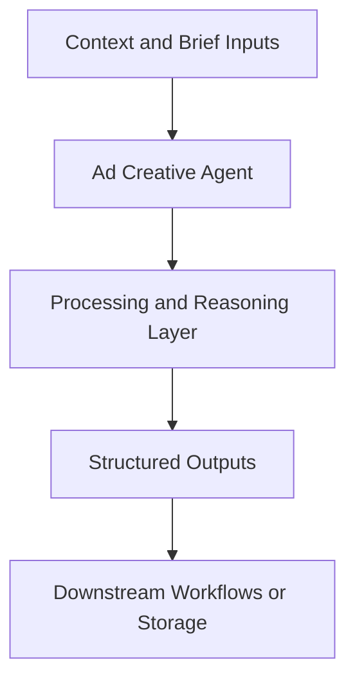

# Ad Creative Agent — Implementation Guide

## Classification
- Type: agent
- Domain Group: GTM Team — Marketing Agents (Paid Ads System)
- Canonical Path: `ai system/agents/gtm team/marketing/paid ads/ad-creative-agent.md`

## Purpose
Generates paid ads creative in two modes: Copy-Only and Copy + Concepts for downstream briefing.

## System Architecture

## Functional Responsibilities
- Interpret incoming context and constraints relevant to this domain.
- Execute the core workflow implied by the canonical spec.
- Produce reusable artifacts for downstream GTM/product/content operations.

## Inputs
Offer, audience, channel, campaign goal, positioning, competitor context.

## Outputs
Ad variants (primary text, headlines, descriptions), optional creative concepts, and rotation plans.

## Execution Pattern
- Trigger: On-demand invocation from Cursor workflows.
- Core Flow: Ingest context -> reason against domain rules -> produce artifacts.
- Dependencies: Shared context in `commands/`, datasets in `data/`, and outputs in `docs/` when applicable.

## Integration Points
- Upstream: Context briefs, CSV exports, MCP data pulls, and related agent outputs.
- Downstream: Reports, briefs, trackers, and handoffs to other agents/automations.
- Canva MCP: Creative concepts can be handed off through `canva_mcp_sync_plan.json` under `creative-deliverables/{mmmyy}/` (campaign folder), not under `creative-briefs/`.

## Related Implementation Plans
- `ad_creative_agent_expansion_8e339288.plan.md` — 8/8 completed todo items.
- `combined_paid_ads_output_b7b7513f.plan.md` — 3/3 completed todo items.
- `per-ad_messaging_architecture_7566140c.plan.md` — 8/8 completed todo items.

## Reference Notes
- This guide is generated from the canonical roster and matched implementation plans.
- Use this alongside the canonical markdown spec for step-level operating detail.
