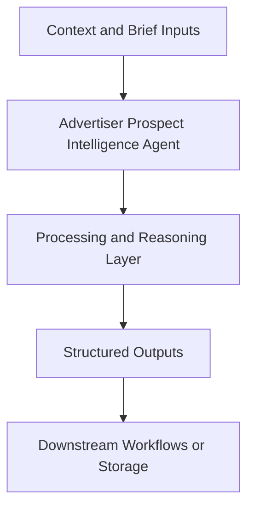

# Advertiser Prospect Intelligence Agent — Implementation Guide

## Classification
- Type: agent
- Domain Group: GTM Team — Sales Agents
- Canonical Path: `ai system/agents/gtm team/sales/advertiser-prospect-agent.md`

## Purpose
Finds and scores ideal advertisers based on funding, ad spend, and fit with Hostfully newsletters. Used for building outbound prospect lists.

## System Architecture

## Functional Responsibilities
- Interpret incoming context and constraints relevant to this domain.
- Execute the core workflow implied by the canonical spec.
- Produce reusable artifacts for downstream GTM/product/content operations.

## Inputs
Ideal customer profile, Hostfully business context, competitor landscape, external ad/SEO signals (Ahrefs, Meta/Google ads, ad libraries).

## Outputs
Ranked CSV prospect lists with scores and signals, plus optional per-company prospect briefs with suggested outreach angles.

## Execution Pattern
- Trigger: On-demand invocation from Cursor workflows.
- Core Flow: Ingest context -> reason against domain rules -> produce artifacts.
- Dependencies: Shared context in `commands/`, datasets in `data/`, and outputs in `docs/` when applicable.

## Integration Points
- Upstream: Context briefs, CSV exports, MCP data pulls, and related agent outputs.
- Downstream: Reports, briefs, trackers, and handoffs to other agents/automations.

## Related Implementation Plans
- `ad_creative_agent_expansion_8e339288.plan.md` — 8/8 completed todo items.
- `hostfully-b2c-b2b-paid-ads-slides_c7f4fb10.plan.md` — 4/4 completed todo items.
- `hostfully-social-and-ads-agents_7071cac8.plan.md` — 10/10 completed todo items.

## Reference Notes
- This guide is generated from the canonical roster and matched implementation plans.
- Use this alongside the canonical markdown spec for step-level operating detail.
