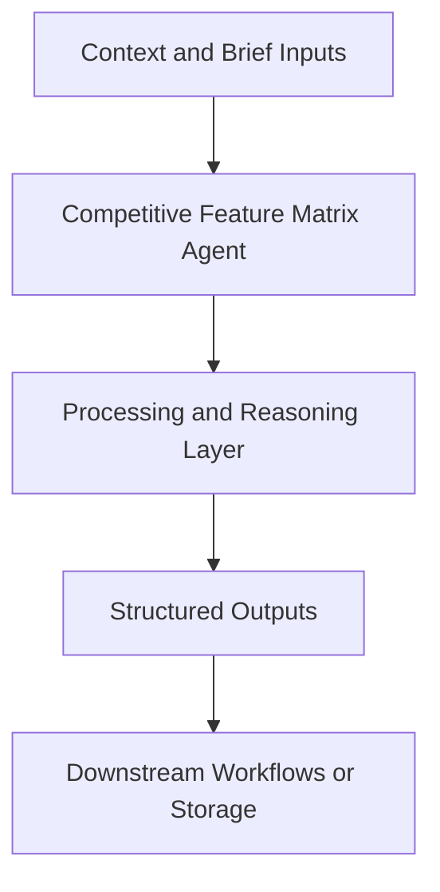

# Competitive Feature Matrix Agent — Implementation Guide

## Classification
- Type: agent
- Domain Group: GTM Team — Product Agents
- Canonical Path: `ai system/agents/gtm team/product/competitive-feature-matrix-agent.md`

## Purpose
Builds and updates feature comparison matrices across Hostfully and competitors.

## System Architecture

## Functional Responsibilities
- Interpret incoming context and constraints relevant to this domain.
- Execute the core workflow implied by the canonical spec.
- Produce reusable artifacts for downstream GTM/product/content operations.

## Inputs
Product features, competitor research, pricing/packaging info.

## Outputs
Competitive feature matrices and narrative commentary.

## Execution Pattern
- Trigger: On-demand invocation from Cursor workflows.
- Core Flow: Ingest context -> reason against domain rules -> produce artifacts.
- Dependencies: Shared context in `commands/`, datasets in `data/`, and outputs in `docs/` when applicable.

## Integration Points
- Upstream: Context briefs, CSV exports, MCP data pulls, and related agent outputs.
- Downstream: Reports, briefs, trackers, and handoffs to other agents/automations.

## Related Implementation Plans
- `update_paths_for_docs_reorg_b0f5c8bd.plan.md` — 7/7 completed todo items.

## Reference Notes
- This guide is generated from the canonical roster and matched implementation plans.
- Use this alongside the canonical markdown spec for step-level operating detail.
