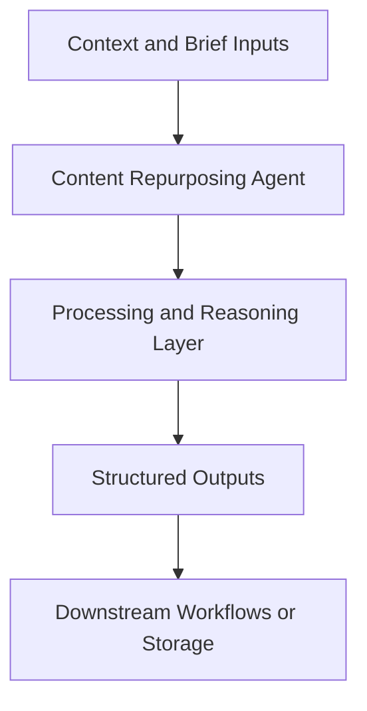

# Content Repurposing Agent — Implementation Guide

## Classification
- Type: agent
- Domain Group: GTM Team — Marketing Agents
- Canonical Path: `ai system/agents/gtm team/marketing/content-repurposing-agent.md`

## Purpose
Converts long-form pieces (blogs, newsletters, webinars) into multi-channel content kits.

## System Architecture

## Functional Responsibilities
- Interpret incoming context and constraints relevant to this domain.
- Execute the core workflow implied by the canonical spec.
- Produce reusable artifacts for downstream GTM/product/content operations.

## Inputs
Source content (text or transcript), brand voice/style guides, target channels and audience.

## Outputs
Social posts, email subject lines, threads, blurbs, executive summaries, and metadata per source.

## Execution Pattern
- Trigger: On-demand invocation from Cursor workflows.
- Core Flow: Ingest context -> reason against domain rules -> produce artifacts.
- Dependencies: Shared context in `commands/`, datasets in `data/`, and outputs in `docs/` when applicable.

## Integration Points
- Upstream: Context briefs, CSV exports, MCP data pulls, and related agent outputs.
- Downstream: Reports, briefs, trackers, and handoffs to other agents/automations.

## Related Implementation Plans
- `tldr-b2c-b2b-paid-ads-slides_c7f4fb10.plan.md` — 4/4 completed todo items.
- `update_paths_for_docs_reorg_b0f5c8bd.plan.md` — 7/7 completed todo items.
- `visual_creative_brief_agent_e97d4bf5.plan.md` — 3/3 completed todo items.

## Reference Notes
- This guide is generated from the canonical roster and matched implementation plans.
- Use this alongside the canonical markdown spec for step-level operating detail.
