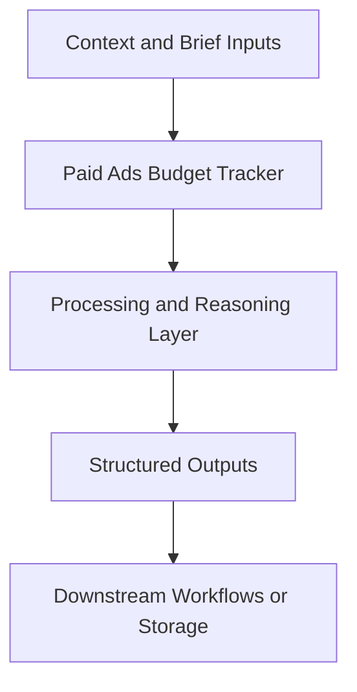

# Paid Ads Budget Tracker — Implementation Guide

## Classification
- Type: python utility
- Domain Group: Standalone Python Utilities (Non-Agent)
- Canonical Path: `ai system/python scripts/paid-ads_budget_tracker/main.py`

## Purpose
Standalone paid media budget allocation utility that joins campaign mapping + performance inputs and computes daily budget recommendations.

## System Architecture

## Functional Responsibilities
- Interpret incoming context and constraints relevant to this domain.
- Execute the core workflow implied by the canonical spec.
- Produce reusable artifacts for downstream GTM/product/content operations.

## Inputs
- Campaign playbook (`docs/paid_ads_assets/campaign_playbook_monthly.csv`) — one row per **campaign**; March 2026 Hostfully plan is **$60k** across Meta + Google with `ca-us_…` / `uk-au_…` style `campaign_id`s. Source detail + ad set splits: `docs/paid_ads_assets/Hostfully_Campaign_Playbook_March2026_Campaign_Structure_and_Budget.csv`; rollup notes in `docs/paid_ads_assets/README.md`.
- Campaign mapping (`data/config/campaign_mapping.csv`) — optional for validation / legacy flows
- **Default:** live pull via [`live_portfolio_fetch.py`](../../../ai%20system/python%20scripts/paid-ads_budget_tracker/live_portfolio_fetch.py) using **same APIs as** [`paid_ads_intelligence_agent.py`](../../../ai%20system/python%20scripts/paid%20ads%20intelligence%20agent/paid_ads_intelligence_agent.py) (aligned with `google_ads_mcp` + Meta Graph credentials in `.env`).
- **Fallback / offline:** `docs/analytics_reports/campaign_snapshot_latest.csv` or `CAMPAIGN_SNAPSHOT_PATH`, or `python main.py --no-live` / `BUDGET_TRACKER_USE_LIVE=0`.

## Outputs
- **Primary:** `docs/analytics_reports/paid_ads_budget_pacing_<date>.xlsx` — one sheet: portfolio KPI block (both channels), **Meta** table + total, **Google** table + total
- `daily_budget_tracker_<date>.csv`, `proposed_budget_changes_<date>.csv` for automation
- **`budget_pacing_analysis_<date>.md`** — generated by [`analysis_report.py`](../../../ai%20system/python%20scripts/paid-ads_budget_tracker/analysis_report.py): original playbook targets, effective targets after redistribution, non-live reallocation, channel + portfolio pacing, per-campaign recommendations, checks/warnings, and a **table of output file paths** for the run (Excel, CSVs, live pull when used)
- Playbook ↔ live **campaign name matching** uses exact (case-insensitive) then **canonical geo keys** ([`campaign_name_match.py`](../../../ai%20system/python%20scripts/paid-ads_budget_tracker/campaign_name_match.py)) e.g. `uk-au_*` ↔ `au-uk_*`. Google GAQL **403** is retried (omit MCC header, search API, alternate `login-customer-id` from accessible customers).

See [`ai system/python scripts/paid-ads_budget_tracker/README.md`](../../../ai%20system/python%20scripts/paid-ads_budget_tracker/README.md).

## Execution Pattern
- Trigger: On-demand invocation from Cursor workflows.
- Core Flow: Ingest context -> reason against domain rules -> produce artifacts.
- Dependencies: Shared context in `commands/`, datasets in `data/`, and outputs in `docs/` when applicable.

## Integration Points
- Upstream: Context briefs, CSV exports, MCP data pulls, and related agent outputs.
- Downstream: Reports, briefs, trackers, and handoffs to other agents/automations.

## Related Implementation Plans
- `paid-budget-spend-tracker_a431b9c4.plan.md` — 4/7 completed todo items.
- `combined_paid_ads_output_b7b7513f.plan.md` — 3/3 completed todo items.
- `meta-ads-mcp-server_8b920550.plan.md` — 4/4 completed todo items.

## Reference Notes
- This guide is generated from the canonical roster and matched implementation plans.
- Use this alongside the canonical markdown spec for step-level operating detail.
