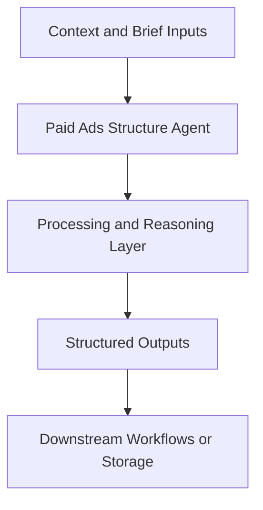

# Paid Ads Structure Agent — Implementation Guide

## Classification
- Type: agent
- Domain Group: GTM Team — Marketing Agents (Paid Ads System)
- Canonical Path: `ai system/agents/gtm team/marketing/paid ads/paid-ads-structure-agent.md`

## Purpose
Designs and audits account/campaign/ad set structures for paid channels across Google, Meta, LinkedIn, TikTok, and X.

## System Architecture

## Functional Responsibilities
- Interpret incoming context and constraints relevant to this domain.
- Execute the core workflow implied by the canonical spec.
- Produce reusable artifacts for downstream GTM/product/content operations.

## Inputs
Current account structure, objectives, budgets, audiences, tracking setup.

## Outputs
Campaign structure blueprints, naming conventions, UTM schemas, and launch checklists.

## Execution Pattern
- Trigger: On-demand invocation from Cursor workflows.
- Core Flow: Ingest context -> reason against domain rules -> produce artifacts.
- Dependencies: Shared context in `commands/`, datasets in `data/`, and outputs in `docs/` when applicable.

## Intake (Cursor-native questionnaire)
The canonical spec enables a **progressive questioning flow** in chat: the agent walks Steps 1–4 from `paid-ads-structure-agent.md`, presents options, and **waits for your reply before the next step**. This is the default interactive questionnaire behavior in Cursor for this agent.

## Standardized Journey Contract
- This agent is the always-on entrypoint for paid ads activations.
- Any paid-ads-intent prompt variation should trigger the same intake-first journey.
- After intake, it must build the full architecture bundle (campaign structure, ad creative, tracking QA, CRO handoff, AB test plan, build sheet, and creative briefs scaffolding) under `outputs/docs/paid_ads_assets/`.

## Integration Points
- Upstream: Context briefs, CSV exports, MCP data pulls, and related agent outputs.
- Downstream: Reports, briefs, trackers, and handoffs to other agents/automations.

## Related Implementation Plans
- `paid_ads_structure_agent_9d760c2a.plan.md` — 1/1 completed todo items.
- `ad_creative_agent_expansion_8e339288.plan.md` — 8/8 completed todo items.
- `paid-budget-spend-tracker_a431b9c4.plan.md` — 4/7 completed todo items.

## Reference Notes
- This guide is generated from the canonical roster and matched implementation plans.
- Use this alongside the canonical markdown spec for step-level operating detail.
