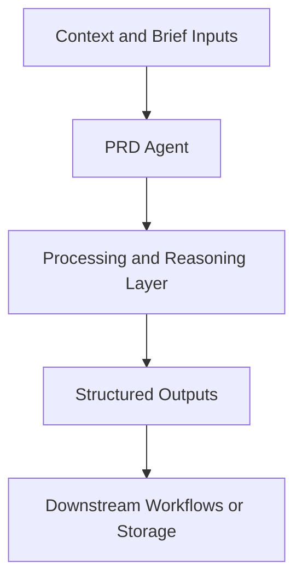

# PRD Agent — Implementation Guide

## Classification
- Type: agent
- Domain Group: Product Strategy & Packaging Agents
- Canonical Path: `ai system/agents/product/prd-agent.md`

## Purpose
Drafts full Product Requirement Documents from high-level problem/solution briefs.

## System Architecture

## Functional Responsibilities
- Interpret incoming context and constraints relevant to this domain.
- Execute the core workflow implied by the canonical spec.
- Produce reusable artifacts for downstream GTM/product/content operations.

## Inputs
Problem statement, goals, constraints, stakeholder notes.

## Outputs
Structured PRDs (background, requirements, UX, success metrics).

## Execution Pattern
- Trigger: On-demand invocation from Cursor workflows.
- Core Flow: Ingest context -> reason against domain rules -> produce artifacts.
- Dependencies: Shared context in `commands/`, datasets in `data/`, and outputs in `docs/` when applicable.

## Integration Points
- Upstream: Context briefs, CSV exports, MCP data pulls, and related agent outputs.
- Downstream: Reports, briefs, trackers, and handoffs to other agents/automations.

## Related Implementation Plans
- `paid_ads_structure_agent_9d760c2a.plan.md` — 1/1 completed todo items.
- `visual_creative_brief_agent_e97d4bf5.plan.md` — 3/3 completed todo items.

## Reference Notes
- This guide is generated from the canonical roster and matched implementation plans.
- Use this alongside the canonical markdown spec for step-level operating detail.
