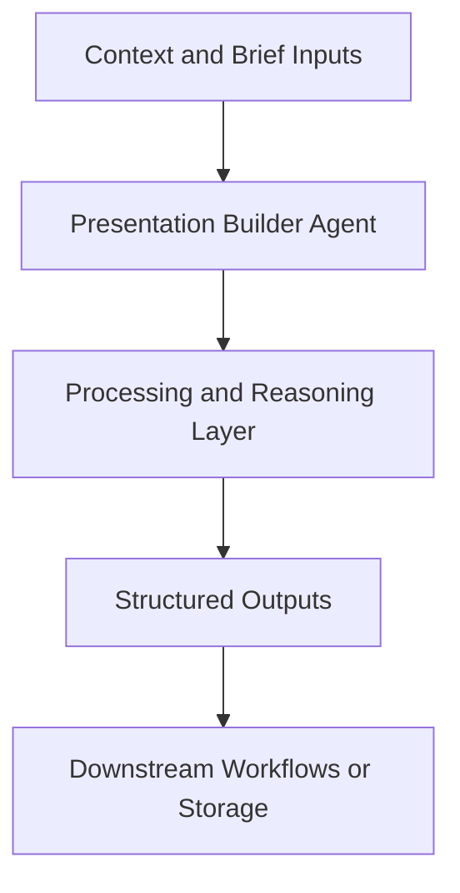

# Presentation Builder Agent — Implementation Guide

## Classification
- Type: agent
- Domain Group: Persona & Role Agents
- Canonical Path: `ai system/agents/personas/presentation-builder-agent.md`

## Purpose
Persona preset for turning any agent’s outputs into markdown-based presentations with timing and slide structure.

## System Architecture

## Functional Responsibilities
- Interpret incoming context and constraints relevant to this domain.
- Execute the core workflow implied by the canonical spec.
- Produce reusable artifacts for downstream GTM/product/content operations.

## Inputs
Goal of the presentation, key points/data, audience.

## Outputs
Slide-by-slide outlines and narrative flows built from existing reports/briefs.

## Execution Pattern
- Trigger: On-demand invocation from Cursor workflows.
- Core Flow: Ingest context -> reason against domain rules -> produce artifacts.
- Dependencies: Shared context in `commands/`, datasets in `data/`, and outputs in `docs/` when applicable.

## Integration Points
- Upstream: Context briefs, CSV exports, MCP data pulls, and related agent outputs.
- Downstream: Reports, briefs, trackers, and handoffs to other agents/automations.

## Related Implementation Plans
- `ad_creative_agent_expansion_8e339288.plan.md` — 8/8 completed todo items.
- `paid_ads_structure_agent_9d760c2a.plan.md` — 1/1 completed todo items.
- `per-ad_messaging_architecture_7566140c.plan.md` — 8/8 completed todo items.

## Reference Notes
- This guide is generated from the canonical roster and matched implementation plans.
- Use this alongside the canonical markdown spec for step-level operating detail.
