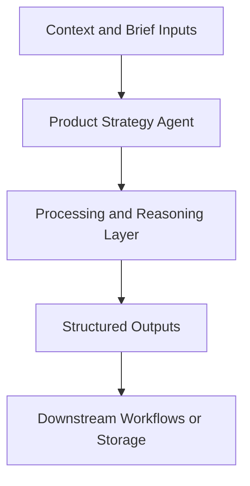

# Product Strategy Agent — Implementation Guide

## Classification
- Type: agent
- Domain Group: Product Strategy & Packaging Agents
- Canonical Path: `ai system/agents/product/product-strategy-agent.md`

## Purpose
Canonical product strategy agent with modes for vision, roadmap, pricing/packaging, and GTM/channel strategy.

## System Architecture

## Functional Responsibilities
- Interpret incoming context and constraints relevant to this domain.
- Execute the core workflow implied by the canonical spec.
- Produce reusable artifacts for downstream GTM/product/content operations.

## Inputs
Market context, customer insights, current product scope, goals.

## Outputs
Strategic narratives, opportunity areas, roadmap themes, and GTM strategy frameworks.

## Execution Pattern
- Trigger: On-demand invocation from Cursor workflows.
- Core Flow: Ingest context -> reason against domain rules -> produce artifacts.
- Dependencies: Shared context in `commands/`, datasets in `data/`, and outputs in `docs/` when applicable.

## Integration Points
- Upstream: Context briefs, CSV exports, MCP data pulls, and related agent outputs.
- Downstream: Reports, briefs, trackers, and handoffs to other agents/automations.

## Related Implementation Plans
- `hostfully-b2c-b2b-paid-ads-slides_c7f4fb10.plan.md` — 4/4 completed todo items.
- `vibehypevideopipeline_af86b17c.plan.md` — 0/6 completed todo items.

## Reference Notes
- This guide is generated from the canonical roster and matched implementation plans.
- Use this alongside the canonical markdown spec for step-level operating detail.
