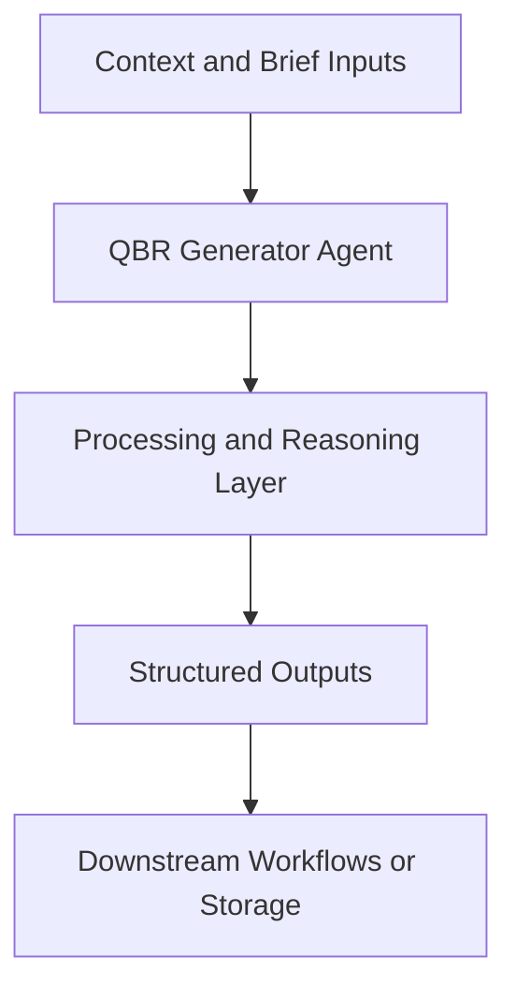

# QBR Generator Agent — Implementation Guide

## Classification
- Type: agent
- Domain Group: GTM Team — Customer Success Agents
- Canonical Path: `ai system/agents/gtm team/customer success/qbr-generator-agent.md`

## Purpose
Builds Quarterly Business Review documents for advertisers using campaign performance data and benchmarks.

## System Architecture

## Functional Responsibilities
- Interpret incoming context and constraints relevant to this domain.
- Execute the core workflow implied by the canonical spec.
- Produce reusable artifacts for downstream GTM/product/content operations.

## Inputs
Advertiser performance history (impressions, CTR, conversions, spend), placement history, Hostfully benchmarks/context.

## Outputs
Per-advertiser QBR markdown docs or decks with exec summaries, performance sections, benchmarks, and recommended next plans.

## Execution Pattern
- Trigger: On-demand invocation from Cursor workflows.
- Core Flow: Ingest context -> reason against domain rules -> produce artifacts.
- Dependencies: Shared context in `commands/`, datasets in `data/`, and outputs in `docs/` when applicable.

## Integration Points
- Upstream: Context briefs, CSV exports, MCP data pulls, and related agent outputs.
- Downstream: Reports, briefs, trackers, and handoffs to other agents/automations.

## Related Implementation Plans
- `paid-budget-spend-tracker_a431b9c4.plan.md` — 4/7 completed todo items.

## Reference Notes
- This guide is generated from the canonical roster and matched implementation plans.
- Use this alongside the canonical markdown spec for step-level operating detail.
