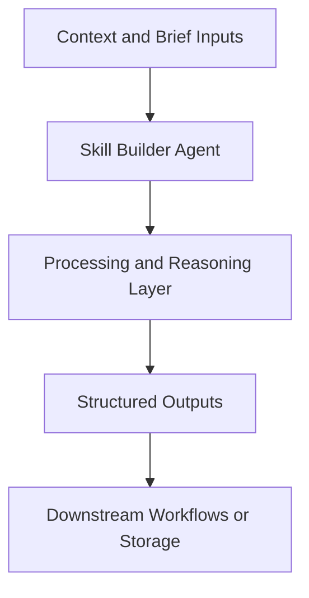

# Skill Builder Agent — Implementation Guide

## Classification
- Type: agent
- Domain Group: Execution Commander Agents
- Canonical Path: `ai system/agents/execution commander/skill-builder-agent.md`

## Purpose
Helps design or refine Cursor skills/agents based on your workflows.

## System Architecture

## Functional Responsibilities
- Interpret incoming context and constraints relevant to this domain.
- Execute the core workflow implied by the canonical spec.
- Produce reusable artifacts for downstream GTM/product/content operations.

## Inputs
Description of desired capability, existing scripts or prompts, constraints.

## Outputs
Draft skill/agent specs and suggested file structures.

## Execution Pattern
- Trigger: On-demand invocation from Cursor workflows.
- Core Flow: Ingest context -> reason against domain rules -> produce artifacts.
- Dependencies: Shared context in `commands/`, datasets in `data/`, and outputs in `docs/` when applicable.

## Integration Points
- Upstream: Context briefs, CSV exports, MCP data pulls, and related agent outputs.
- Downstream: Reports, briefs, trackers, and handoffs to other agents/automations.

## Related Implementation Plans
- `cursor_automations_brainstorm_97eb7e7d.plan.md` — 10/10 completed todo items.
- `ad_creative_agent_expansion_8e339288.plan.md` — 8/8 completed todo items.
- `claude_skill_builder_agent_52a1e919.plan.md` — 1/1 completed todo items.

## Reference Notes
- This guide is generated from the canonical roster and matched implementation plans.
- Use this alongside the canonical markdown spec for step-level operating detail.
