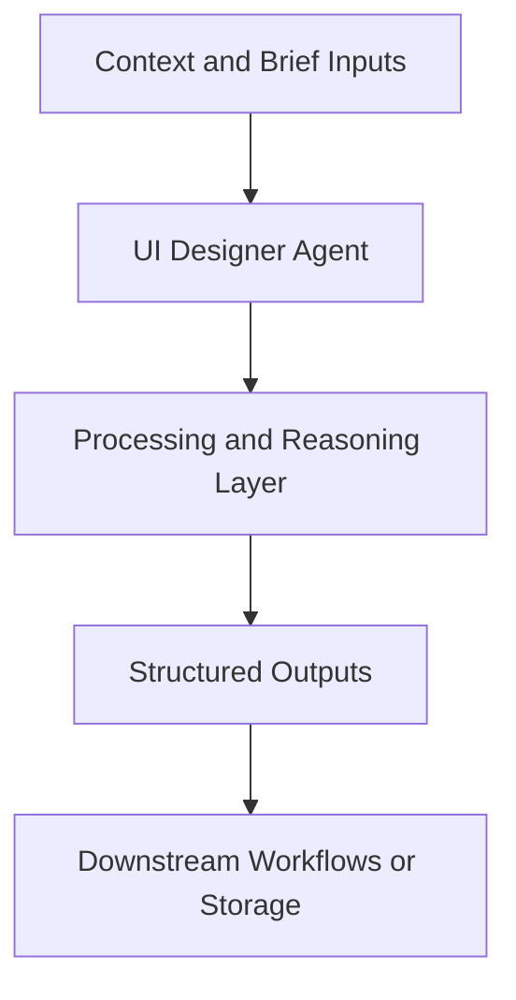

# UI Designer Agent — Implementation Guide

## Classification
- Type: agent
- Domain Group: UI & UX Agents
- Canonical Path: `ai system/agents/ui-ux/ui-designer-agent.md`

## Purpose
Canonical UI design agent with modes for new flows, refreshes, design systems, and dev-ready handoff.

## System Architecture

## Functional Responsibilities
- Interpret incoming context and constraints relevant to this domain.
- Execute the core workflow implied by the canonical spec.
- Produce reusable artifacts for downstream GTM/product/content operations.

## Inputs
Product requirements, brand guidelines, constraints, and desired fidelity.

## Outputs
Layout descriptions, component specs, system tokens, and implementation notes.

## Execution Pattern
- Trigger: On-demand invocation from Cursor workflows.
- Core Flow: Ingest context -> reason against domain rules -> produce artifacts.
- Dependencies: Shared context in `commands/`, datasets in `data/`, and outputs in `docs/` when applicable.

## Integration Points
- Upstream: Context briefs, CSV exports, MCP data pulls, and related agent outputs.
- Downstream: Reports, briefs, trackers, and handoffs to other agents/automations.

## Related Implementation Plans
- `visual_creative_brief_agent_e97d4bf5.plan.md` — 3/3 completed todo items.
- `ad_creative_agent_expansion_8e339288.plan.md` — 8/8 completed todo items.
- `google_ads_mcp_server_496b3202.plan.md` — 0/7 completed todo items.

## Reference Notes
- This guide is generated from the canonical roster and matched implementation plans.
- Use this alongside the canonical markdown spec for step-level operating detail.
