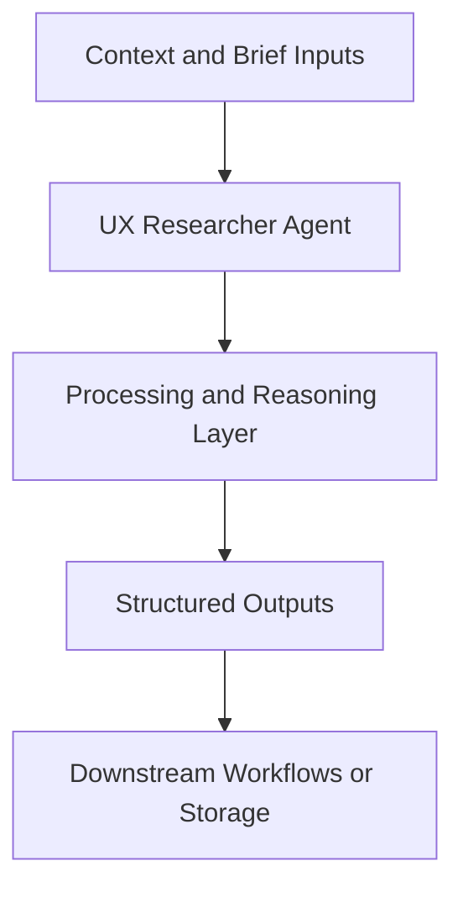

# UX Researcher Agent — Implementation Guide

## Classification
- Type: agent
- Domain Group: UI & UX Agents
- Canonical Path: `ai system/agents/ui-ux/ux-researcher-agent.md`

## Purpose
Canonical UX research agent with modes for discovery, diagnostics, validation, and synthesis.

## System Architecture

## Functional Responsibilities
- Interpret incoming context and constraints relevant to this domain.
- Execute the core workflow implied by the canonical spec.
- Produce reusable artifacts for downstream GTM/product/content operations.

## Inputs
Research goals, target users, existing insights, product/flow context.

## Outputs
Right-sized research plans, artifacts (guides, scripts), and decision-ready synthesis.

## Execution Pattern
- Trigger: On-demand invocation from Cursor workflows.
- Core Flow: Ingest context -> reason against domain rules -> produce artifacts.
- Dependencies: Shared context in `commands/`, datasets in `data/`, and outputs in `docs/` when applicable.

## Integration Points
- Upstream: Context briefs, CSV exports, MCP data pulls, and related agent outputs.
- Downstream: Reports, briefs, trackers, and handoffs to other agents/automations.

## Related Implementation Plans
- No directly matching implementation plan found in `.cursor/plans`; guide synthesized from canonical roster/specs.

## Reference Notes
- This guide is generated from the canonical roster and matched implementation plans.
- Use this alongside the canonical markdown spec for step-level operating detail.
