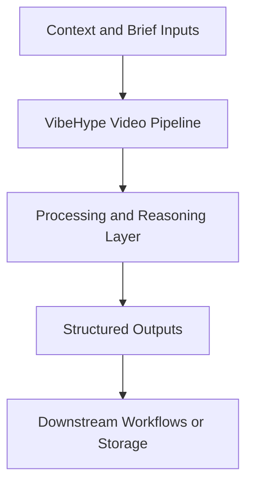

# VibeHype Video Pipeline — Implementation Guide

## Classification
- Type: production tool (js/ts)
- Domain Group: Standalone Python Utilities (Non-Agent)
- Canonical Path: `ai system/video/`

## Purpose
Remotion-based video production toolchain for paid ads creative, used to render 9:16 and 16:9 hype/trailer assets from storyboarded UI compositions.

## System Architecture

## Functional Responsibilities
- Interpret incoming context and constraints relevant to this domain.
- Execute the core workflow implied by the canonical spec.
- Produce reusable artifacts for downstream GTM/product/content operations.

## Inputs
Storyboard/compositions in `ai system/video/src/`, render target (`COMP`), output path (`OUT`), and optional music/post edits in downstream tooling.

## Outputs
Rendered MP4 assets (for Reels/TikTok/Shorts and horizontal variants) under `ai system/video/out/`.

## Execution Pattern
- Trigger: On-demand invocation from Cursor workflows.
- Core Flow: Ingest context -> reason against domain rules -> produce artifacts.
- Dependencies: Shared context in `commands/`, datasets in `data/`, and outputs in `docs/` when applicable.

## Integration Points
- Upstream: Context briefs, CSV exports, MCP data pulls, and related agent outputs.
- Downstream: Reports, briefs, trackers, and handoffs to other agents/automations.

## Related Implementation Plans
- `vibehypevideopipeline_af86b17c.plan.md` — 0/6 completed todo items.
- `combined_paid_ads_output_b7b7513f.plan.md` — 3/3 completed todo items.
- `update_paths_for_docs_reorg_b0f5c8bd.plan.md` — 7/7 completed todo items.

## Reference Notes
- This guide is generated from the canonical roster and matched implementation plans.
- Use this alongside the canonical markdown spec for step-level operating detail.
