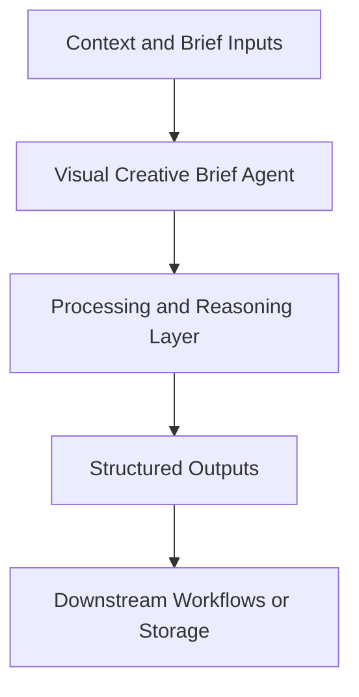

# Visual Creative Brief Agent — Implementation Guide

## Classification
- Type: agent
- Domain Group: GTM Team — Marketing Agents (Paid Ads System)
- Canonical Path: `ai system/agents/gtm team/marketing/paid ads/visual-creative-brief-agent.md`

## Purpose
Turns ad-creative concepts into production-ready creative briefs with platform-specific specs and safe zones.

## System Architecture

## Functional Responsibilities
- Interpret incoming context and constraints relevant to this domain.
- Execute the core workflow implied by the canonical spec.
- Produce reusable artifacts for downstream GTM/product/content operations.

## Inputs
Ad creative outputs, campaign structure, creative direction, brand guidelines.

## Outputs
Designer-ready briefs per concept under `creative-briefs/{mmmyy}/`. Built handoffs (`*_canva-deliverables_*.md`, `canva_mcp_sync_plan.json`) go under `creative-deliverables/{mmmyy}/` in the same campaign folder — never mixed into briefs.

## Execution Pattern
- Trigger: On-demand invocation from Cursor workflows.
- Core Flow: Ingest context -> reason against domain rules -> produce artifacts.
- Dependencies: Shared context in `commands/`, datasets in `data/`, and outputs in `docs/` when applicable.

## Integration Points
- Upstream: Context briefs, CSV exports, MCP data pulls, and related agent outputs.
- Downstream: Reports, briefs, trackers, and handoffs to other agents/automations.

## Related Implementation Plans
- `visual_creative_brief_agent_e97d4bf5.plan.md` — 3/3 completed todo items.
- `per-ad_messaging_architecture_7566140c.plan.md` — 8/8 completed todo items.
- `update_paths_for_docs_reorg_b0f5c8bd.plan.md` — 7/7 completed todo items.

## Reference Notes
- This guide is generated from the canonical roster and matched implementation plans.
- Use this alongside the canonical markdown spec for step-level operating detail.
