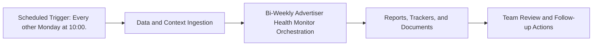

# Bi-Weekly Advertiser Health Monitor — Implementation Guide

## Classification
- Type: automation
- Tier/Group: Tier 2 — High-Value Intelligence Loops
- Schedule: Every other Monday at 10:00.

## Purpose
Operationalizes the Advertiser Health & Churn analysis stack as a recurring automation.

## System Architecture

## Functional Responsibilities
- Execute the recurring workflow at the configured cadence.
- Pull required MCP/script/context dependencies.
- Produce operational artifacts for GTM, product, content, and CS teams.

## Inputs
- Meta Ads Portfolio + Google Ads Portfolio MCP data per advertiser.
- `advertiser_health.py` and `churn_analyzer.py` scripts and configs.
- Any external CSVs or Sheets with advertiser metadata and benchmarks.

## Outputs
- Bi-weekly health-scored advertiser list (CSV and Google Sheet).
- Google Doc narrative highlighting Yellow/Red accounts and recommended actions.

## Execution Pattern
- Trigger: Scheduler-based execution.
- Core Flow: Collect signals -> run orchestration -> emit reports and artifacts.
- Dependencies: MCP servers, Python scripts, CSV trackers, and Google Docs/Sheets endpoints.

## Integration Points
- Upstream: MCP data sources, internal trackers, and prior automation outputs.
- Downstream: Planning reviews, campaign updates, content roadmap decisions, and account actions.

## Related Implementation Plans
- No directly matching implementation plan found in `.cursor/plans`; guide synthesized from automation roster.

## Reference Notes
- This guide is generated from your automation roster and matched implementation plans.
- Pair this with runbooks/config files for step-level operating instructions.
