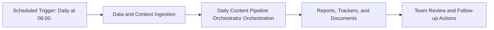

# Daily Content Pipeline Orchestrator — Implementation Guide

## Classification
- Type: automation
- Tier/Group: Tier 1 — LaunchAgent Replacements (Core Schedulers)
- Schedule: Daily at 08:00.

## Purpose
Replaces `com.tofulab.contentpipeline.plist`. Orchestrates competitor content scraping, pipeline scoring, SEO enrichment, and daily visibility for the team.

## System Architecture

## Functional Responsibilities
- Execute the recurring workflow at the configured cadence.
- Pull required MCP/script/context dependencies.
- Produce operational artifacts for GTM, product, content, and CS teams.

## Inputs
- Competitor blog list and scraper config (`competitor-blog-scraper.py`).
- Existing content pipeline CSVs.
- Ahrefs MCP credentials (keywords explorer tools).
- Google Sheets MCP config (target sheet for summaries).

## Outputs
- Updated `competitor_content_tracker.csv`.
- Updated `content_pipeline.csv` with search volume/difficulty enrichment.
- Daily summary row in a Google Sheet for pipeline status.

## Execution Pattern
- Trigger: Scheduler-based execution.
- Core Flow: Collect signals -> run orchestration -> emit reports and artifacts.
- Dependencies: MCP servers, Python scripts, CSV trackers, and Google Docs/Sheets endpoints.

## Integration Points
- Upstream: MCP data sources, internal trackers, and prior automation outputs.
- Downstream: Planning reviews, campaign updates, content roadmap decisions, and account actions.

## Related Implementation Plans
- No directly matching implementation plan found in `.cursor/plans`; guide synthesized from automation roster.

## Reference Notes
- This guide is generated from your automation roster and matched implementation plans.
- Pair this with runbooks/config files for step-level operating instructions.
