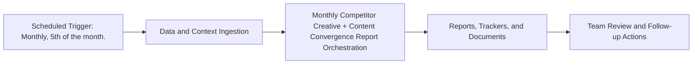

# Monthly Competitor Creative + Content Convergence Report — Implementation Guide

## Classification
- Type: automation
- Tier/Group: Tier 3 — Advanced Compound Automations
- Schedule: Monthly, 5th of the month.

## Purpose
Combines competitor ads, content, and SEO data into a single strategic intelligence report.

## System Architecture

## Functional Responsibilities
- Execute the recurring workflow at the configured cadence.
- Pull required MCP/script/context dependencies.
- Produce operational artifacts for GTM, product, content, and CS teams.

## Inputs
- Meta Ad Library MCP (competitor ad pulls).
- `competitor_content_tracker.csv` for blog/content.
- Ahrefs MCP (competitor organic keywords, top pages).
- `competitive_tracker.py` and any competitor blog scraper configs.

## Outputs
- Google Doc strategic brief showing overlapping “bets” (topics with both ads + content), gaps vs TLDR, and recommended responses.

## Execution Pattern
- Trigger: Scheduler-based execution.
- Core Flow: Collect signals -> run orchestration -> emit reports and artifacts.
- Dependencies: MCP servers, Python scripts, CSV trackers, and Google Docs/Sheets endpoints.

## Integration Points
- Upstream: MCP data sources, internal trackers, and prior automation outputs.
- Downstream: Planning reviews, campaign updates, content roadmap decisions, and account actions.

## Related Implementation Plans
- `update_paths_for_docs_reorg_b0f5c8bd.plan.md` — 7/7 completed todo items.
- `claude_skill_builder_agent_52a1e919.plan.md` — 1/1 completed todo items.
- `visual_creative_brief_agent_e97d4bf5.plan.md` — 3/3 completed todo items.

## Reference Notes
- This guide is generated from your automation roster and matched implementation plans.
- Pair this with runbooks/config files for step-level operating instructions.
