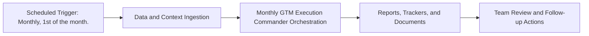

# Monthly GTM Execution Commander — Implementation Guide

## Classification
- Type: automation
- Tier/Group: Tier 3 — Advanced Compound Automations
- Schedule: Monthly, 1st of the month.

## Purpose
Closes the loop between performance data and GTM planning by powering `gtm_commander.py` with live data.

## System Architecture

## Functional Responsibilities
- Execute the recurring workflow at the configured cadence.
- Pull required MCP/script/context dependencies.
- Produce operational artifacts for GTM, product, content, and CS teams.

## Inputs
- Previous month’s Google Ads and Meta Ads performance via MCPs.
- SEO trends from Ahrefs MCP.
- Content performance and pipeline data (from CSVs or Sheets).
- `gtm_commander.py` sprint planning configuration.

## Outputs
- Monthly GTM retrospective and next-month sprint plan in Google Docs.
- Optionally, updated JSON/CSV planning artifacts for internal use.

## Execution Pattern
- Trigger: Scheduler-based execution.
- Core Flow: Collect signals -> run orchestration -> emit reports and artifacts.
- Dependencies: MCP servers, Python scripts, CSV trackers, and Google Docs/Sheets endpoints.

## Integration Points
- Upstream: MCP data sources, internal trackers, and prior automation outputs.
- Downstream: Planning reviews, campaign updates, content roadmap decisions, and account actions.

## Related Implementation Plans
- No directly matching implementation plan found in `.cursor/plans`; guide synthesized from automation roster.

## Reference Notes
- This guide is generated from your automation roster and matched implementation plans.
- Pair this with runbooks/config files for step-level operating instructions.
