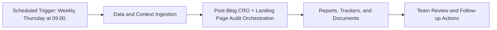

# Post-Blog CRO + Landing Page Audit — Implementation Guide

## Classification
- Type: automation
- Tier/Group: Tier 2 — High-Value Intelligence Loops
- Schedule: Weekly, Thursday at 09:00.

## Purpose
Ties new content and key landing pages into a recurring CRO audit loop.

## System Architecture

## Functional Responsibilities
- Execute the recurring workflow at the configured cadence.
- Pull required MCP/script/context dependencies.
- Produce operational artifacts for GTM, product, content, and CS teams.

## Inputs
- Playwright MCP (navigation, screenshots, DOM snapshots).
- Ahrefs MCP (top pages and traffic metrics).
- `cro_hypothesis_agent.py` configuration and list of key pages.

## Outputs
- Screenshots/snapshots of key pages.
- CRO hypothesis backlogs and A/B test recommendations in Google Docs.

## Execution Pattern
- Trigger: Scheduler-based execution.
- Core Flow: Collect signals -> run orchestration -> emit reports and artifacts.
- Dependencies: MCP servers, Python scripts, CSV trackers, and Google Docs/Sheets endpoints.

## Integration Points
- Upstream: MCP data sources, internal trackers, and prior automation outputs.
- Downstream: Planning reviews, campaign updates, content roadmap decisions, and account actions.

## Related Implementation Plans
- `update_paths_for_docs_reorg_b0f5c8bd.plan.md` — 7/7 completed todo items.

## Reference Notes
- This guide is generated from your automation roster and matched implementation plans.
- Pair this with runbooks/config files for step-level operating instructions.
