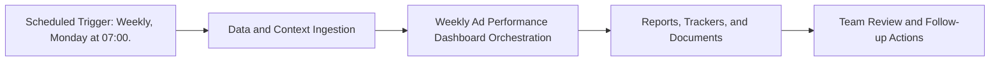

# Weekly Ad Performance Dashboard — Implementation Guide

## Classification
- Type: automation
- Tier/Group: Tier 2 — High-Value Intelligence Loops
- Schedule: Weekly, Monday at 07:00.

## Purpose
Pure-MCP automation that builds a cross-channel ad performance snapshot before standup.

## System Architecture

## Functional Responsibilities
- Execute the recurring workflow at the configured cadence.
- Pull required MCP/script/context dependencies.
- Produce operational artifacts for GTM, product, content, and CS teams.

## Inputs
- Google Ads Portfolio MCP (account summary, campaign, and keyword performance).
- Meta Ads Portfolio MCP (account and campaign performance).
- Config for which accounts/campaigns to track and comparison baselines.

## Outputs
- Weekly narrative performance report (Google Doc).
- Updated running tracker in Google Sheets with WoW metrics and anomaly flags.

## Execution Pattern
- Trigger: Scheduler-based execution.
- Core Flow: Collect signals -> run orchestration -> emit reports and artifacts.
- Dependencies: MCP servers, Python scripts, CSV trackers, and Google Docs/Sheets endpoints.

## Integration Points
- Upstream: MCP data sources, internal trackers, and prior automation outputs.
- Downstream: Planning reviews, campaign updates, content roadmap decisions, and account actions.

## Related Implementation Plans
- `paid-budget-spend-tracker_a431b9c4.plan.md` — 4/7 completed todo items.
- `paid_ads_structure_agent_9d760c2a.plan.md` — 1/1 completed todo items.

## Reference Notes
- This guide is generated from your automation roster and matched implementation plans.
- Pair this with runbooks/config files for step-level operating instructions.
