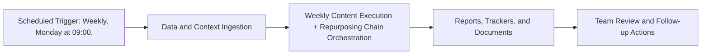

# Weekly Content Execution + Repurposing Chain — Implementation Guide

## Classification
- Type: automation
- Tier/Group: Tier 1 — LaunchAgent Replacements (Core Schedulers)
- Schedule: Weekly, Monday at 09:00.

## Purpose
Replaces `com.tofulab.contentpipeline.weekly.plist`. Runs content execution, humanizer quality gate, repurposing, and pushes everything into Docs.

## System Architecture

## Functional Responsibilities
- Execute the recurring workflow at the configured cadence.
- Pull required MCP/script/context dependencies.
- Produce operational artifacts for GTM, product, content, and CS teams.

## Inputs
- Content pipeline entries ready for execution.
- `execution_commander.py` configuration.
- Humanizer skill and thresholds (AI score cutoffs).
- `repurpose_agent.py` and `video_script_agent.py` configs.
- Google Docs MCP credentials and target folders.

## Outputs
- Draft blog posts.
- Humanizer-scored and optionally rewritten versions.
- Repurposed assets (LinkedIn, X, email, newsletter blurbs, video scripts).
- Google Docs containing final content sets per piece.

## Execution Pattern
- Trigger: Scheduler-based execution.
- Core Flow: Collect signals -> run orchestration -> emit reports and artifacts.
- Dependencies: MCP servers, Python scripts, CSV trackers, and Google Docs/Sheets endpoints.

## Integration Points
- Upstream: MCP data sources, internal trackers, and prior automation outputs.
- Downstream: Planning reviews, campaign updates, content roadmap decisions, and account actions.

## Related Implementation Plans
- `claude_skill_builder_agent_52a1e919.plan.md` — 1/1 completed todo items.
- `cursor_automations_brainstorm_97eb7e7d.plan.md` — 10/10 completed todo items.
- `update_paths_for_docs_reorg_b0f5c8bd.plan.md` — 7/7 completed todo items.

## Reference Notes
- This guide is generated from your automation roster and matched implementation plans.
- Pair this with runbooks/config files for step-level operating instructions.
