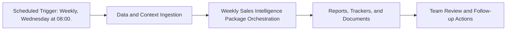

# Weekly Sales Intelligence Package — Implementation Guide

## Classification
- Type: automation
- Tier/Group: Tier 2 — High-Value Intelligence Loops
- Schedule: Weekly, Wednesday at 08:00.

## Purpose
Bundles fresh prospecting and updated battlecards into a single weekly drop for Sales.

## System Architecture

## Functional Responsibilities
- Execute the recurring workflow at the configured cadence.
- Pull required MCP/script/context dependencies.
- Produce operational artifacts for GTM, product, content, and CS teams.

## Inputs
- Ahrefs MCP (site metrics, paid pages) for prospect discovery.
- Meta Ad Library MCP for ad presence checks.
- `prospect_intelligence.py` and `battlecard_generator.py` scripts.
- Existing competitor landscape and content trackers.

## Outputs
- Fresh prospect list in Google Sheets with scores and signals.
- Updated competitor battlecards in Google Docs.

## Execution Pattern
- Trigger: Scheduler-based execution.
- Core Flow: Collect signals -> run orchestration -> emit reports and artifacts.
- Dependencies: MCP servers, Python scripts, CSV trackers, and Google Docs/Sheets endpoints.

## Integration Points
- Upstream: MCP data sources, internal trackers, and prior automation outputs.
- Downstream: Planning reviews, campaign updates, content roadmap decisions, and account actions.

## Related Implementation Plans
- `claude_skill_builder_agent_52a1e919.plan.md` — 1/1 completed todo items.

## Reference Notes
- This guide is generated from your automation roster and matched implementation plans.
- Pair this with runbooks/config files for step-level operating instructions.
