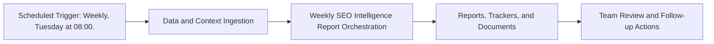

# Weekly SEO Intelligence Report — Implementation Guide

## Classification
- Type: automation
- Tier/Group: Tier 2 — High-Value Intelligence Loops
- Schedule: Weekly, Tuesday at 08:00.

## Purpose
Connects Ahrefs data to your content pipeline and SEO agents for consistent visibility.

## System Architecture

## Functional Responsibilities
- Execute the recurring workflow at the configured cadence.
- Pull required MCP/script/context dependencies.
- Produce operational artifacts for GTM, product, content, and CS teams.

## Inputs
- Ahrefs MCP (organic keywords, top pages, metrics history, organic competitors, rank tracker).
- `search_ranking_agent.py` and `site_performance_agent.py` configurations.
- List of tracked domains/keywords.

## Outputs
- Google Doc report with striking-distance keywords, top pages, and competitor moves.
- Recommendations mapped back to your content pipeline.

## Execution Pattern
- Trigger: Scheduler-based execution.
- Core Flow: Collect signals -> run orchestration -> emit reports and artifacts.
- Dependencies: MCP servers, Python scripts, CSV trackers, and Google Docs/Sheets endpoints.

## Integration Points
- Upstream: MCP data sources, internal trackers, and prior automation outputs.
- Downstream: Planning reviews, campaign updates, content roadmap decisions, and account actions.

## Related Implementation Plans
- `tldr-social-and-ads-agents_7071cac8.plan.md` — 10/10 completed todo items.

## Reference Notes
- This guide is generated from your automation roster and matched implementation plans.
- Pair this with runbooks/config files for step-level operating instructions.
