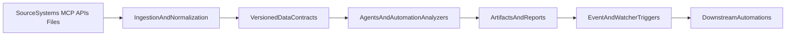

# Input Automation Roadmap

## Objective

Eliminate recurring manual data uploads across the TLDR AI system by replacing file-staging and placeholder-driven steps with connectorized ingestion, inter-workflow contracts, and safe fallback controls.

## Audit Basis (Code-Grounded)

This roadmap is based on runtime architecture in:

- `ai system/python scripts/`
- `ai system/automations/`
- `ai system/automations/lib/`
- `ai system/agents/`

Primary manual-input patterns found in code:

1. Required CLI arguments for source files/IDs (`--file`, `--data`, `--sitemap`, `CAMPAIGN_ID`, date placeholders).
2. Interactive prompts (`input()`) in campaign/creative flows.
3. Hardcoded local reads of CSV/MD/TXT in `docs/`, `data/`, and `commands/`.
4. Pre-staged folder assumptions (especially date-partitioned audience pipelines).
5. Environment-token gating causing degraded/manual fallback.
6. Implicit handoffs via "latest file in folder" instead of explicit contracts.

## Current Feasibility Summary

- **Fully automatable now (with current connectors):** major parts of SEO, paid ads pulls, competitor ad intel, docs/sheets publishing, Playwright evidence capture.
- **Partially automatable now:** workflows still requiring curated entity lists, policy thresholds, or final editorial judgment.
- **Must remain human-gated:** strategic prioritization, approval workflows, compliance-sensitive exclusions, and final outbound content signoff.

## Manual Dependency Inventory and Automation Blueprint

## Agent/Script Dependencies

| Domain | Manual Input Dependency | Current Source | Target Automation Pathway | Feasibility |
| --- | --- | --- | --- | --- |
| Sales | Transcript folders and ad-hoc note bundles | `docs/sales call transcripts`, local files | Ingestion queue + transcript watcher + normalization contract | Partial |
| Sales | Prospect domain/company placeholders | CLI args in sales scripts | CRM/prospect feed connector + entity registry | Partial |
| Paid Ads | Campaign IDs and date placeholders in orchestration | Automation markdown placeholders | Campaign resolver service + run manifest generated IDs | Full |
| Paid Ads | Interactive ad creative intake (`input()`) | `meta_creative_agent.py` | Non-interactive JSON brief mode + prefilled briefs from upstream | Full |
| Customer Success | Seeded advertiser performance CSVs | `data/advertiser_performance/*.csv` | Scheduled pull from ad APIs + canonical account metrics table | Full |
| Product | Interview/feature/changelog file drops | local file args | Helpdesk/interview/repo connectors + parser jobs | Partial |
| Content/SEO | Tracker CSV staging and key/date placeholders | `docs/competitor content tracker/...` | Scheduled API pulls + schema-validated tracker updates | Full |
| CRO | Manual key page lists and screenshot snippets | markdown instructions | URL inventory contract + scheduled Playwright capture | Partial |
| Execution Commander | Upstream artifact discovery by folder scan | filesystem latest-file logic | Event contracts (`artifact.ready`) + run ledger | Full |

## Automation-Level Dependencies

| Automation | Manual Input Today | Connectorization Path | Fallback Required |
| --- | --- | --- | --- |
| Daily Content Pipeline | `KEYWORD_HERE`, source list curation | Keyword/topic service + competitor registry + Ahrefs pull wrapper | Use last successful keyword set and run in degraded mode |
| Weekly Content Execution | `PATH_TO_BLOG`, `SLUG`, manual quality gates | Artifact-triggered execution from pipeline outputs + auto slugging | Keep manual file-target override |
| Monthly Competitive Ad Intelligence | Competitor list curation | Competitor entity registry + FB/Meta/Google pull adapters | Cached previous month with freshness banner |
| Weekly Ad Performance Dashboard | `CAMPAIGN_ID` selection | Top-campaign selector per account + run manifest | Manual campaign override list |
| Weekly SEO Intelligence | `TODAY_DATE`, `90_DAYS_AGO_DATE`, competitor domain substitution | Scheduled date resolver + competitor registry + Ahrefs/GSC pull | Snapshot fallback when APIs fail |
| Bi-Weekly Advertiser Health | First-run data seeding | Scheduled account/campaign ingestion to canonical metrics table | Continue manual CSV seed pathway |
| Weekly Sales Intelligence | `PROSPECT_DOMAIN`, manual tiering | Prospect entity feed + scoring service + dedupe table | Manual shortlist upload |
| Weekly CRO Audit | Manual page targeting | Auto page inventory from top pages + recent publish artifacts | Manual URL list file |
| Monthly GTM Commander | Manual campaign ID substitution + mutable template writes | Planner data-pack connector + versioned plan artifacts | Roll back to last successful plan artifact |
| Monthly Competitor Convergence | Manual convergence interpretation | Structured convergence scorer (deterministic) + LLM narrative layer | Narrative-only mode with explicit caveats |

## Creative Automation Pathways (Beyond MCP/API/Internal Handoffs)

1. **Event-driven artifact contracts**
   - Emit machine events (`artifact.created`, `artifact.ready`, `artifact.stale`) when scripts finish.
   - Replace fragile downstream "scan latest file" patterns.

2. **Run manifest DAG**
   - Write `manifest.json` per run with input hashes, schema version, dependency status, freshness, provenance.
   - Enable deterministic reruns and safe replay.

3. **Queue-based ingestion**
   - Route transcripts, CSV exports, and API pulls through a queue with retries and dead-letter handling.
   - Prevent silent no-op behavior when source files are missing.

4. **Drive/Filesystem watcher triggers**
   - Trigger downstream tasks on new upstream artifacts in canonical folders.
   - Remove manual kickoff once data arrives.

5. **Deterministic parser + LLM narrator split**
   - Compute metrics in deterministic code; reserve model for narrative synthesis.
   - Reduces KPI drift and regression risk.

6. **Retrieval cache and freshness budgets**
   - Cache expensive source pulls with TTL and provenance metadata.
   - Use stale-but-acceptable data only under policy-defined limits.

7. **Canonical path resolver**
   - Abstract `docs/` vs `outputs/docs/` path differences into one resolver.
   - Preserve backward compatibility during migration.

8. **Progressive enrichment**
   - If one source fails, build partial artifacts with explicit confidence and missing-field annotations.
   - Avoid full pipeline stop for non-critical gaps.

## Data Contract Design

Define typed contracts for key cross-workflow artifacts:

- `content_pipeline_item`
- `competitor_entity`
- `campaign_performance_snapshot`
- `advertiser_health_score`
- `sales_prospect_score`
- `cro_page_observation`
- `gtm_plan_artifact`

Required contract metadata:

- `schema_version`
- `producer_workflow`
- `logical_period`
- `generated_at`
- `freshness_expires_at`
- `input_hashes`
- `degraded_mode` (boolean)
- `degraded_reason` (optional)

## Risks and Production Guardrails

### System-Wide Guardrails

- Idempotency keys: `workflow_name + logical_period`.
- Preflight checks: auth, required env vars, path access, schema presence.
- Source-specific circuit breakers with bounded retries and backoff.
- Atomic writes (`tmp -> promote`) for all artifacts.
- Run ledger for every execution (status, retries, source health, outputs).
- Shadow mode for new connectors before cutover.
- Canary rollout by workflow class (content -> ads -> CS -> planning).

### Zero-Breakage Fallbacks (Mandatory)

For every connectorized input:

1. Keep existing manual/staged path available as hot standby.
2. Run dual-read during migration:
   - primary: new connector
   - fallback: current manual source.
3. On connector failure:
   - trip source circuit breaker
   - use last-known-good snapshot if freshness SLA passes
   - else route to manual source and continue
   - mark run `degraded_mode=true`.
4. Keep rollback pointers to previous working connector config/version.
5. Never remove manual path until:
   - three successful canary cycles
   - zero schema failures
   - no output regressions.

### Human-Gated Inputs That Should Stay Manual

- Strategic threshold tuning (risk tiers, campaign priorities).
- Competitor universe governance and policy exclusions.
- Final editorial/brand approvals before publishing externally.
- Sensitive account-level decision signoff.

## Phased Implementation Plan

### Phase 0: Stabilize and Observe (P0)

- Add preflight checks, run ledger, and path resolver.
- Standardize contract metadata for all major outputs.
- Introduce idempotency keys and atomic writes.

### Phase 1: Connectorize High-Volume Inputs (P1)

- Advertiser performance ingestion connector.
- Competitor/ad pull normalization connector.
- Transcript/ticket ingestion queue.
- Campaign ID/date resolver service.

### Phase 2: Inter-Workflow Automation (P2)

- Event contracts + watcher triggers.
- Stateful manifests and dependency-based orchestration.
- Deterministic metric parsing across weekly/monthly reports.

### Phase 3: Scale and Harden (P3)

- Full schema registry and compatibility checks.
- Confidence scoring and progressive enrichment.
- Automated regression diffing for report outputs.

## Validation Criteria

Each workflow must have:

- current manual dependency
- automated source target
- fallback source
- cutover criteria
- rollback plan.

Program-level success metrics:

- >= 70% reduction in manual file uploads for recurring workflows.
- >= 95% scheduled runs complete without manual intervention.
- 0 critical operational outages attributable to connector migration.
- all degraded-mode runs surfaced with explicit provenance and freshness.
