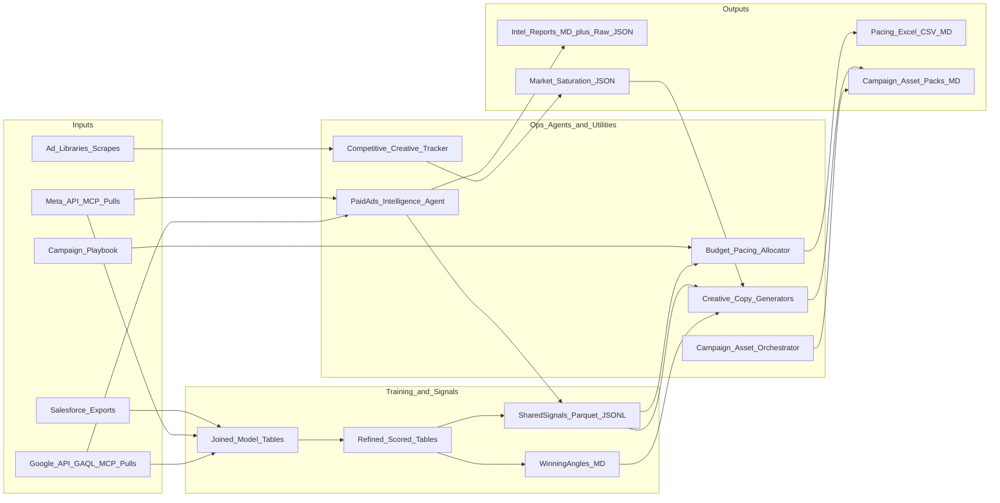

## Executive summary

This repo’s paid ads system is a **multi-agent pipeline** that combines:

- **Budget/pacing automation** (deterministic, coefficient-driven)
- **Performance intelligence** (deterministic metrics + LLM narrative)
- **Creative + copy generation** (LLM generation with retrieval from Hostfully winners)
- **Competitive tracking** (scraped ad libraries + angle taxonomy + market saturation constraints)

The system is “congruent” because the same success definition is reused everywhere:

- **Business outcome first**: Salesforce-attributed ROI proxy dominates
- **Platform metrics second**: used to modulate decisions, not override business ROI
- **Confidence gates**: minimum sample size thresholds prevent overfitting to noise

Everything is **Mar 2026 onward** by design.

---

## System map (components and interconnectivity)

---

## What “training” means here (important)

There is **no model fine-tuning** in this repo.

“Training” means building a **retrieval-ready context repository** + **machine-readable signals** so that agents:

- reference historically winning angles and creative primitives
- apply consistent gates (confidence, fatigue, volatility)
- use consistent scoring (85/15 blend) across allocation and content decisions

---

## Artifacts and where they live

### Context repository (human-readable, retrieval-ready)

- `docs/context_repository/paid_ads/README.md`
- `docs/context_repository/paid_ads/winning_angles/`:
  - `meta_mar2026_onward.md`
  - `google_mar2026_onward.md`
  - `top10_reusable_angles_mar2026_onward.md`
  - `strict_winners_mar2026_onward.md`

### Training data manifest (what was pulled and where)

- `docs/context_repository/paid_ads/training_data_manifest.md`

### Shared signals (machine-readable congruent logic)

- Schema: `docs/context_repository/paid_ads/shared_signals_schema.md`
- Outputs:
  - `outputs/training_data/paid_ads/signals/signals_latest.parquet`
  - `outputs/training_data/paid_ads/signals/signals_latest.jsonl`
  - Partitioned Parquet by `platform=.../grain=.../entity_type=.../signals.parquet`

### Joined/scored modeling tables (used to build winners/signals)

- `outputs/training_data/paid_ads/joined/meta_ads_refined_scored.csv`
- `outputs/training_data/paid_ads/joined/google_assets_refined_scored.csv`

---

## Agent inventory (markdown agents + python scripts)

### 1) Budget / pacing system (deterministic allocator)

**Primary entrypoint**

- `ai system/python scripts/paid-ads_budget_tracker/main.py`

**Key modules**

- `ai system/python scripts/paid-ads_budget_tracker/performance_scores.py` (in-platform scoring)
- `ai system/python scripts/paid-ads_budget_tracker/pipeline_roi.py` (Salesforce ROI weighting)
- `ai system/python scripts/paid-ads_budget_tracker/pacing_allocation.py` (85/15 ROI-first budget redistribution + guardrails)
- `ai system/python scripts/paid-ads_budget_tracker/intelligence_bridge.py` (ties shared signals into pacing inputs)

**Outputs**

- `docs/analytics_reports/budget pacing/<YYYY-MM-DD>/paid_ads_budget_pacing_<date>.xlsx`
- `docs/analytics_reports/budget pacing/<YYYY-MM-DD>/daily_budget_tracker_<date>.csv`
- `docs/analytics_reports/budget pacing/<YYYY-MM-DD>/proposed_budget_changes_<date>.csv`
- `docs/analytics_reports/budget pacing/<YYYY-MM-DD>/budget_pacing_analysis_<date>.md`

#### Model weights and decision logic (pacing)

**A) In-platform performance score weights (45/10/10/35)**

From `ai system/python scripts/paid-ads_budget_tracker/performance_scores.py` (defaults in `config.py`: `perf_weight_cost`, `perf_weight_engagement`, `perf_weight_conversion`, `perf_weight_volume`):

- **0.45 cost structure**: \(targetCPL / actualCPL\) clipped to \([0.1, 10]\)
- **0.10 engagement**: \(CTR / medianCTR\) clipped to \([0.25, 4]\)
- **0.10 conversion**: \(CVR / medianCVR\) clipped to \([0.25, 4]\)
- **0.35 volume**: \(leads / medianLeads\) clipped to \([0.25, 4]\)

**B) ROI weighting (Salesforce, closed-won boosted)**

From `ai system/python scripts/paid-ads_budget_tracker/pipeline_roi.py`:

\[
roi\_priority\_weight = pipeline\_amount + 2 \times closed\_won\_amount
\]

**C) Blended priority (85/15)**

From `ai system/python scripts/paid-ads_budget_tracker/pacing_allocation.py`:

\[
blended = 0.85 \times ROI\_{norm} + 0.15 \times Perf\_{norm}
\]

**D) Eligibility logic (increase vs decrease sets)**

From `performance_scores.py`:

- Increase set: `performance_bucket == "good"` or `performance_score >= Q75`
- Decrease set: `performance_bucket == "poor"` or `performance_score <= Q25`

**E) Allocation sharpness**

From `ai system/python scripts/paid-ads_budget_tracker/config.py`:

- `weight_alpha` controls concentration (default `2.0`)

**F) Guardrails**

From `config.py`:

- `max_daily_change_pct` (default `0.3`)
- `min_daily_budget`, `max_daily_budget`

#### Congruent tie-breakers (signals → pacing)

The pacing allocator remains ROI-first; it now accepts optional columns (provided by `intelligence_bridge.py`) that only **nudge** blended weights:

- `has_winning_angle`: bonus
- `fatigue_flag`: penalty
- `volatility_flag`: penalty
- `low_confidence_flag`: penalty

Tunables live in `ai system/python scripts/paid-ads_budget_tracker/config.py`:

- `winning_angle_bonus`
- `fatigue_penalty`
- `volatility_penalty`
- `low_confidence_penalty`

These are applied multiplicatively as a bounded modifier (so they can’t dominate ROI).

---

### 2) Paid Ads Intelligence Agent (analysis layer)

**Entrypoint**

- `ai system/python scripts/paid ads intelligence agent/paid_ads_intelligence_agent.py`

**What it does**

- Pulls live Meta + Google performance
- Computes **deterministic lead attribution logic** (Meta action taxonomy)
- Writes raw data + structured lead analysis
- Uses an LLM to write an analyst-grade narrative report
- Emits machine-readable **signals** per platform run (`signals.jsonl` + `signals.parquet`)

#### Meta conversion accounting policy (required)

- For **Meta conversion analysis**, the intelligence layer must use **conversion-time accounting only**.
- Do **not** use impression-time accounting for conversion counts in analyst outputs, summaries, or pacing diagnostics.
- Every Meta conversion report must explicitly declare:
  - conversion action(s) used,
  - attribution window used,
  - report-time basis = `conversion_time`.
- If a source payload is impression-time by default, normalize/restate conversion metrics to conversion-time before reporting final numbers.

**Outputs (per run)**

- `docs/paid ads intelligence/<week-folder>/meta_ads/raw_data.json`
- `docs/paid ads intelligence/<week-folder>/meta_ads/lead_analysis.json`
- `docs/paid ads intelligence/<week-folder>/meta_ads/performance_report.md`
- `docs/paid ads intelligence/<week-folder>/meta_ads/signals.jsonl` + `signals.parquet`
- same pattern under `google_ads/`

#### “Model weights” in the intelligence layer

The intelligence agent is primarily **deterministic rules + thresholds**, not a numeric scoring model like pacing.

Key weight-like knobs:

- **WoW materiality threshold**: flags shifts > **15%** (encoded as guidance in prompts and now centralized as `INTELLIGENCE_SIGNAL_THRESHOLDS["wow_materiality_pct"]`)
- **Meta primary conversion event logic**: maps campaigns to a single “Results” action type; includes support for `lead_email-valid` starting **2026-03-01**

#### Congruence with training

The intelligence agent now emits `signals.jsonl/parquet` so downstream systems can reuse:

- platform + time range
- entity ID/name
- confidence class

Note: ROI joins are intentionally kept in the training/join layer; intelligence signals remain platform-derived unless explicitly joined.

---

### 3) Paid ads “training” pipeline (Hostfully winners → retrieval + signals)

**Purpose**

Convert raw platform performance + Salesforce outcomes into:

- **WinningAngles** (human-readable library)
- **Refined scored tables** (modeling tables)
- **Shared signals** (Parquet + JSONL for congruent downstream consumption)

**Core scripts**

- `ai system/python scripts/paid-ads_training/salesforce_ingest.py` (Salesforce normalization + ROI weights)
- `ai system/python scripts/paid-ads_training/meta_extract_winners.py` (Meta creative breakdowns; prioritizes `lead_email-valid`)
- `ai system/python scripts/paid-ads_training/refine_winner_scores.py` (explicit 85/15 blended scoring + confidence gates)
- `ai system/python scripts/paid-ads_training/build_shared_signals.py` (writes `outputs/training_data/paid_ads/signals/…`)

#### Training scoring logic (explicit)

From `refine_winner_scores.py`:

- **ROI_norm**: median-normalized, clipped
- **Perf_norm**:
  - Meta: \(0.7 \times norm(results/spend) + 0.3 \times norm(ctr)\)
  - Google: \(0.7 \times norm(conversions/clicks) + 0.3 \times norm(ctr)\)
- **Blended**: \(0.85 \times ROI\_norm + 0.15 \times Perf\_norm\)

#### Confidence gates

From `docs/context_repository/paid_ads/shared_signals_schema.md` and `build_shared_signals.py`:

- `high`: impr >= 5000, clicks >= 100, results >= 5
- `medium`: impr >= 2000, clicks >= 40, results >= 2
- `low`: impr >= 1000, clicks >= 20, results >= 1
- `insufficient`: otherwise

---

### 4) Campaign asset orchestration (scaffolding)

**Entrypoint**

- `ai system/python scripts/paid acquisition agent/paid_ads_campaign_orchestrator.py`

**What it does**

Creates a complete campaign “asset pack” folder under `docs/paid_ads_assets/` including:

- campaign structure file (to be filled by structure agent)
- ad creative file (to be filled by ad creative agent)
- creative briefs folder/index (to be filled by visual brief agent)
- landing page/CRO doc, tracking QA doc, build sheet, experiment plan

This is scaffolding only; it does not score performance.

---

### 5) Creative + copy generation (LLM + retrieval)

There are two “creative generation” surfaces in this repo:

1) **Markdown agent specs** (human-in-the-loop agent workflows)\n
2) **Python generators** (Gemini-based script utilities)\n

#### A) Markdown agents (human-in-the-loop)

- `ai system/agents/gtm team/marketing/paid ads/ad-creative-agent.md`\n
  - Generates ad creative variants\n
  - Supports iteration mode when performance data is provided\n
- `ai system/agents/gtm team/marketing/paid ads/visual-creative-brief-agent.md`\n
  - Converts concepts into production briefs\n
- `ai system/agents/gtm team/marketing/paid ads/paid-ads-structure-agent.md`\n
  - Defines campaign structure/naming/UTMs\n
  - **Intake (enabled by default):** interactive **progressive questionnaire in Cursor chat** (one step at a time; agent waits for answers).\n

These do not hardcode numeric weights; they apply procedural logic and constraints.

#### B) Python creative/copy generators (automatable)

- `ai system/python scripts/paid acquisition agent/social_ads_agent.py`\n
  - **Now retrieval-driven**: reads Hostfully winners + shared signals\n
  - Policy encoded in prompt: **80% proven primitives**, **20% exploration**\n
- `ai system/python scripts/paid acquisition agent/search_ads_agent.py`\n
  - Keyword clustering + strict RSA copy formatting\n
  - No performance weighting yet (can be added similarly via shared signals)\n

#### What data “trains” creative generation

Creative agents are conditioned via retrieval from:

- `docs/context_repository/paid_ads/winning_angles/*` (human-readable winners)\n
- `outputs/training_data/paid_ads/signals/signals_latest.jsonl` (structured winner signals)\n
- optionally competitor saturation constraints (see below)\n

---

### 6) Competitive creative tracking (market context)

**Entrypoint (script)**

- `ai system/python scripts/competitive creative tracker/competitive_tracker.py`

**What it does**

- Scrapes competitor ad libraries across platforms\n
- Writes persistent CSV logs\n
- **Now tags** competitor ads into a simple angle taxonomy\n
- Emits a market saturation artifact:\n
  - `docs/context_repository/paid_ads/winning_angles/market_saturation_summary_mar2026_onward.json`\n

**How it connects**

The market saturation summary is a **constraint input** to creative generation:\n
avoid saturated angles unless Hostfully strict winners show strong outperformance.\n

---

## Congruent decision logic (system-wide principles)

### Principle 1: ROI dominates, platforms modulate

- Budget allocation uses **85% CRM ROI** + **15% in-platform health**.\n
- Creative training rankings use the same **85/15** philosophy.\n

### Principle 2: Deterministic logic produces the numbers; LLMs narrate

- Pacing decisions are deterministic and reproducible.\n
- Intelligence agent computes deterministic lead logic; LLM writes the report.\n

### Principle 3: Confidence gating prevents overfitting

- Winner signals include `confidence_class`.\n
- Pacing tie-break nudges can penalize low-confidence entities.\n

---

## “What data trained what” (explicit mapping)

| System part | Uses which data | Where it lives | Purpose |
|---|---|---|---|
| Budget pacing allocator | Playbook + live spend/leads + Salesforce ROI + shared signals modifiers | `docs/paid_ads_assets/…`, `docs/analytics_reports/budget pacing/…`, `outputs/training_data/paid_ads/signals/…` | Daily budget recommendations |
| Intelligence agent | Live Meta/Google pulls + deterministic lead mapping | `docs/paid ads intelligence/<week>/…` | Weekly performance narrative + diagnostic signals |
| Training / winners | Meta/Google pulls + Salesforce exports (Mar 2026+) | `outputs/training_data/paid_ads/**`, `docs/context_repository/paid_ads/**` | Build winning-angles library + shared signals |
| Social ads concept generation | Winning angles MD + shared signals JSONL | `docs/context_repository/paid_ads/winning_angles/*`, `outputs/training_data/paid_ads/signals/*` | Bias creative toward historically winning Hostfully patterns |
| Competitive tracker | Scraped ad libraries | `docs/competitor content tracker/paid ads creatives/*` + market summary JSON | Market context + saturation constraints |

---

## Appendix A — Canonical weights, coefficients, thresholds (quick reference)

### Pacing / allocation\n
- In-platform performance score: **45/10/10/35** (`AllocationConfig.perf_weight_*`)\n
- ROI weighting: \(pipeline + 2 \times closed\_won\)\n
- Budget blend: **85% ROI / 15% in-platform**\n
- Weight sharpness: `weight_alpha=2.0`\n
- Guardrail: `max_daily_change_pct=0.3`\n

### Training / winners\n
- Blended score: **85/15**\n
- Confidence class thresholds:\n
  - high: 5000 impr / 100 clicks / 5 results\n
  - medium: 2000 / 40 / 2\n
  - low: 1000 / 20 / 1\n
\n
### Intelligence heuristics\n
- WoW materiality: **15%** default investigate threshold\n
- Meta results primary event: `lead_email-valid` supported from **2026-03-01**\n
\n
---\n
\n
## Appendix B — “How to walk a marketer through the flow” (suggested narrative)\n
\n
1) Start with the playbook + CRM outcomes: the system is built to optimize **business value**, not vanity metrics.\n
2) Show pacing: deterministic, explainable, guardrailed.\n
3) Show intelligence: deterministic lead logic + narrative reporting.\n
4) Show training: winners library + shared signals unify definitions.\n
5) Show creative generation: constrained creativity (proven primitives first).\n
6) Show competitive: market saturation prevents copycat overfitting.\n
\n

## Appendix C — Phase 2 build completion (validation)\n
\n
The following were added for reproducibility and marketer-facing transparency:\n
\n
- **Pacing markdown** includes a **source reliability & coverage** block (API vs snapshot, coverage ratio, Meta spend reconcile when available) and **playbook↔live match QA** when match metadata exists.\n
- **Daily tracker / analysis tables** include **tie-break decomposition**: `blended_core_85_15`, per-signal deltas (`tie_break_delta_*`), `tie_break_modifier_before_net_cap`, and final `tie_break_modifier`.\n
- **Weighted redistribution** is documented in the analysis markdown when enabled (`redistribute_use_weighted`).\n
- **Intelligence signals** emit `action_priority_score` and `anomaly_score`; weekly reports receive a **pre-computed ranked anomaly table** (Sections 8.5 Meta / 9.5 Google) for the LLM to reproduce and interpret.\n
- **Search ads agent** outputs an **Angle Tag** column and loads **`angle_priors_mar2026_onward.json`** when present (written by `creative_mapping.py`).\n
- **Social ads agent** appends **saturation training notes** to each run file and requires a per-concept **Saturation note** line.\n
- **Schema reference**: `docs/context_repository/paid_ads/shared_signals_schema.md`.\n
\n
