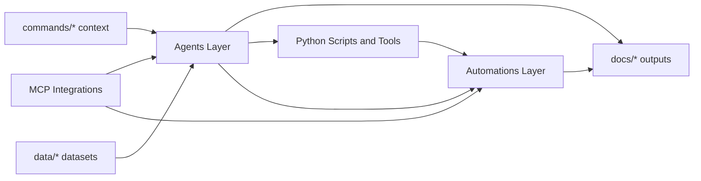

# System Bible

Comprehensive reference map for the Hostfully AI system. This document links every detailed guide and explains how the full stack fits together: agents, automations, shared context, and outputs.

## System Topology

## Canonical Directories

- Agents: `ai system/agents/`
- Automations: `ai system/automations/`
- Python scripts: `ai system/python scripts/`
- MCP assets: `ai system/mcp/`
- Shared context/input: `commands/`, `data/`
- Output artifacts: `docs/`, `outputs/`

## How To Use This Bible

- Start with the domain section relevant to your workflow (Sales, Paid Ads, Product, etc.).
- Open the linked implementation guide for architecture, responsibilities, inputs, outputs, and integration points.
- Use the automations section to understand cadence-based orchestration and recurring reporting loops.
- Use implementation plan index for historical build intent and completion status.

## Agent Guides By Domain

### Sales
- [advertiser-prospect-intelligence-agent.md](agents/advertiser-prospect-intelligence-agent.md)
- [competitive-battlecard-agent.md](agents/competitive-battlecard-agent.md)
- [deal-risk-agent.md](agents/deal-risk-agent.md)
- [sales-call-transcript-analyzer.md](agents/sales-call-transcript-analyzer.md)

### Paid Ads and Creative Production
- [ad-creative-agent.md](agents/ad-creative-agent.md)
- [competitor-ad-intelligence-agent.md](agents/competitor-ad-intelligence-agent.md)
- [paid-ads-budget-tracker.md](agents/paid-ads-budget-tracker.md)
- [paid-ads-structure-agent.md](agents/paid-ads-structure-agent.md)
- [vibehype-video-pipeline.md](agents/vibehype-video-pipeline.md)
- [visual-creative-brief-agent.md](agents/visual-creative-brief-agent.md)

### Customer Success
- [advertiser-health-agent.md](agents/advertiser-health-agent.md)
- [churn-analyzer-agent.md](agents/churn-analyzer-agent.md)
- [feedback-synthesizer-agent.md](agents/feedback-synthesizer-agent.md)
- [qbr-generator-agent.md](agents/qbr-generator-agent.md)
- [support-ticket-analyzer-agent.md](agents/support-ticket-analyzer-agent.md)

### Product Operations
- [competitive-feature-matrix-agent.md](agents/competitive-feature-matrix-agent.md)
- [engagement-behavior-agent.md](agents/engagement-behavior-agent.md)
- [feature-request-prioritizer-agent.md](agents/feature-request-prioritizer-agent.md)
- [prd-task-breakdown-agent.md](agents/prd-task-breakdown-agent.md)
- [release-notes-agent.md](agents/release-notes-agent.md)
- [sprint-planner-agent.md](agents/sprint-planner-agent.md)
- [user-interview-synthesizer-agent.md](agents/user-interview-synthesizer-agent.md)

### Content and Social
- [content-performance-agent.md](agents/content-performance-agent.md)
- [content-repurposing-agent.md](agents/content-repurposing-agent.md)
- [copywriting-agent.md](agents/copywriting-agent.md)
- [email-sequence-agent.md](agents/email-sequence-agent.md)
- [social-media-agent.md](agents/social-media-agent.md)

### SEO and AEO
- [aeo-audit-agent.md](agents/aeo-audit-agent.md)
- [seo-agent.md](agents/seo-agent.md)
- [seo-audit-agent.md](agents/seo-audit-agent.md)

### Product Strategy and Packaging
- [prd-agent.md](agents/prd-agent.md)
- [pricing-packaging-agent.md](agents/pricing-packaging-agent.md)
- [product-strategy-agent.md](agents/product-strategy-agent.md)

### Technical and Growth Engineering
- [analytics-tracking-agent.md](agents/analytics-tracking-agent.md)
- [cro-agent.md](agents/cro-agent.md)
- [growth-interactive-tool-agent.md](agents/growth-interactive-tool-agent.md)
- [n8n-workflow-agent.md](agents/n8n-workflow-agent.md)

### UI and UX
- [ui-designer-agent.md](agents/ui-designer-agent.md)
- [ux-researcher-agent.md](agents/ux-researcher-agent.md)

### Execution Commander
- [skill-builder-agent.md](agents/skill-builder-agent.md)
- [workflow-orchestration-agent.md](agents/workflow-orchestration-agent.md)

### Persona Presets
- [competitive-creative-tracker-agent.md](agents/competitive-creative-tracker-agent.md)
- [data-engineer-agent.md](agents/data-engineer-agent.md)
- [growth-engineer-agent.md](agents/growth-engineer-agent.md)
- [growth-hacker-agent.md](agents/growth-hacker-agent.md)
- [it-agent.md](agents/it-agent.md)
- [presentation-builder-agent.md](agents/presentation-builder-agent.md)
- [trend-researcher-agent.md](agents/trend-researcher-agent.md)

### Additional Agent/Tool Guides
- None

## Automation Guides

### Core Schedulers and Reporting Loops
- [bi-weekly-advertiser-health-monitor.md](automations/bi-weekly-advertiser-health-monitor.md)
- [daily-content-pipeline-orchestrator.md](automations/daily-content-pipeline-orchestrator.md)
- [monthly-competitive-ad-intelligence.md](automations/monthly-competitive-ad-intelligence.md)
- [monthly-competitor-creative-content-convergence-report.md](automations/monthly-competitor-creative-content-convergence-report.md)
- [monthly-gtm-execution-commander.md](automations/monthly-gtm-execution-commander.md)
- [post-blog-cro-landing-page-audit.md](automations/post-blog-cro-landing-page-audit.md)
- [weekly-ad-performance-dashboard.md](automations/weekly-ad-performance-dashboard.md)
- [weekly-content-execution-repurposing-chain.md](automations/weekly-content-execution-repurposing-chain.md)
- [weekly-sales-intelligence-package.md](automations/weekly-sales-intelligence-package.md)
- [weekly-seo-intelligence-report.md](automations/weekly-seo-intelligence-report.md)

## Build History and Plan Intelligence

- Implementation plans discovered: **14**
- Master plan index: [implementation_plans_index.md](implementation_plans_index.md)

## End-to-End Dataflow (Practical)

1. Inputs enter through strategic context (`commands/*`) and structured data (`data/*`, MCP pulls).
2. Agents and Python tools process, synthesize, and generate decision-ready artifacts.
3. Automations orchestrate recurring execution on schedule for continuous intelligence.
4. Final assets land in `docs/*` (reports, briefs, trackers, campaign artifacts).
5. Teams consume outputs for GTM execution, product planning, SEO/content, and advertiser operations.

## Maintenance Rules

- Keep canonical definitions in `ai system/` only.
- Keep output artifacts in root `docs/` and `outputs/`.
- When adding a new agent/automation, create its implementation guide and link it here.
- Update rosters first, regenerate/update guides second, then update this bible index.
