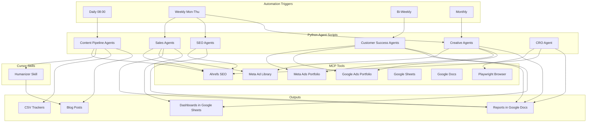

# Cursor Automations Implementation Plan

## Current State Summary

Your workspace is a GTM operations hub for Hostfully with:

- **50+ Python agent scripts** across 15 agent categories (content, sales, SEO, ads, customer success, product, etc.)
- **93 MCP tools** across 7 servers: Meta Ad Library, Playwright, Google Sheets, Google Docs, Google Ads, Meta Ads, Ahrefs
- **1 Cursor skill** (humanizer) for AI copy scoring/rewriting
- **3 macOS LaunchAgent plists** for scheduling (daily content planning, weekly execution, monthly ad tracking)
- **CSV-based data pipelines** feeding between agents

### Current Scheduling (fragile LaunchAgent plists)

| Schedule         | Script                                          | Plist                                            |
| ---------------- | ----------------------------------------------- | ------------------------------------------------ |
| Daily 08:00      | `commander.py` (blog scraper + pipeline)        | `com.hostfully.contentpipeline.plist`              |
| Weekly Mon 09:00 | `execution_commander.py` (blog writer + social) | `com.hostfully.contentpipeline.weekly.plist`       |
| Monthly 28th     | `heartbeat_monthly.py` (ad tracker)             | `com.hostfully.tech.competitivetracker.monthly.plist` |

---

## Proposed Automations

### Tier 1 -- Replace Existing Schedules (migrate LaunchAgents to Cursor)

These three automations directly replace your current macOS LaunchAgent plists with more reliable, observable Cursor Automations that can leverage MCP tools and produce richer outputs.

#### 1. Daily Content Pipeline Orchestrator

**Schedule:** Daily at 08:00
**LaunchAgent:** `com.hostfully.contentpipeline.plist`

**What it does:**

1. Run `competitor-blog-scraper.py` to scan competitor blogs and update [competitor_content_tracker.csv](docs/competitor creative tracker/blogs/competitor_content_tracker.csv)
2. Run `pipeline_agent.py` to score and prioritize concepts into [content_pipeline.csv](docs/competitor creative tracker/blogs/content_pipeline.csv)
3. Use **Ahrefs MCP** (`keywords-explorer-overview`, `keywords-explorer-matching-terms`) to enrich pipeline items with search volume and difficulty data
4. Push a daily summary to **Google Sheets MCP** (`update_google_sheet`) for team visibility

**Why Cursor Automation is better:** Can chain MCP tool calls (Ahrefs keyword enrichment) that the standalone Python script cannot do. Better error observability than a plist.

#### 2. Weekly Content Execution + Repurposing Chain

**Schedule:** Weekly, Monday 09:00
**LaunchAgent:** `com.hostfully.contentpipeline.weekly.plist`

**What it does:**

1. Run `execution_commander.py` to generate blog posts from the pipeline
2. Run the **humanizer skill** on each generated blog to score AI-ness and auto-rewrite if score < 7/10
3. Run `repurpose_agent.py` to create LinkedIn, Twitter, email, and newsletter variants
4. Run `video_script_agent.py` to generate short-form video scripts from each post
5. Push all outputs to **Google Docs MCP** (`create_google_doc`, `update_google_doc`) for editorial review

**Why Cursor Automation is better:** Can chain the humanizer quality gate and multi-format repurposing that currently require manual intervention. Single observable pipeline instead of scattered scripts.

#### 3. Monthly Competitive Ad Intelligence

**Schedule:** Monthly, last day of month
**Replaces:** `com.hostfully.tech.competitivetracker.monthly.plist`

**What it does:**

1. Use **Meta Ad Library MCP** (`get_meta_platform_id`, `get_meta_ads`) to pull competitor ads for all tracked brands
2. Use `analyze_ad_image` and `analyze_ad_video` MCP tools to analyze creative trends
3. Pull own ad performance from **Meta Ads Portfolio MCP** (`get_account_summary`, `list_campaigns`) and **Google Ads Portfolio MCP** (`get_account_summary`, `list_campaigns`)
4. Generate a competitive creative brief comparing competitor creative strategies vs own performance
5. Update [ad_creative_log.csv](docs/competitor creative tracker/paid ads creatives/ad_creative_log.csv) and [ad_volume_tracker.csv](docs/competitor creative tracker/paid ads creatives/ad_volume_tracker.csv)
6. Push formatted report to **Google Docs MCP**

**Why Cursor Automation is better:** Can pull and cross-reference data from 3 MCP sources (Meta Ad Library, Meta Ads, Google Ads) that the standalone Python script cannot access. Adds image/video analysis.

---

### Tier 2 -- New High-Value Automations

These are net-new automations that combine existing scripts with MCP tools to create intelligence loops that don't exist today.

#### 4. Weekly Ad Performance Dashboard

**Schedule:** Weekly, Monday 07:00 (before team standup)
**Scripts used:** None directly (pure MCP)

**What it does:**

1. Pull weekly metrics from **Google Ads Portfolio MCP** (`get_account_summary`, `get_campaign_performance`, `get_keywords_performance`)
2. Pull weekly metrics from **Meta Ads Portfolio MCP** (`get_account_summary`, `get_campaign_performance`)
3. Compare WoW trends, flag anomalies (CPC spikes, CTR drops, budget pacing issues)
4. Generate a formatted weekly performance summary
5. Push to **Google Sheets MCP** (append row to a running tracker) and **Google Docs MCP** (weekly narrative report)

**Key value:** Eliminates manual dashboard pulls. Provides a written narrative, not just numbers.

#### 5. Weekly SEO Intelligence Report

**Schedule:** Weekly, Tuesday 08:00
**Scripts used:** [search_ranking_agent.py](ai system/python scripts/content and seo pipeline agent/search_ranking_agent.py), [site_performance_agent.py](ai system/python scripts/content and seo pipeline agent/site_performance_agent.py)

**What it does:**

1. Use **Ahrefs MCP** (`site-explorer-organic-keywords`, `site-explorer-top-pages`, `site-explorer-metrics-history`) to pull Hostfully's organic performance
2. Use **Ahrefs MCP** (`site-explorer-organic-competitors`) to check competitor movement
3. Use **Ahrefs MCP** (`rank-tracker-overview`) to check tracked keyword positions
4. Identify striking-distance keywords (positions 4-20) with optimization recommendations
5. Cross-reference with content pipeline to identify gaps
6. Push report to **Google Docs MCP**

**Key value:** Connects Ahrefs data directly to your content pipeline, creating a feedback loop between SEO performance and content planning.

#### 6. Bi-Weekly Advertiser Health Monitor

**Schedule:** Every other Monday, 10:00
**Scripts used:** [advertiser_health.py](ai system/python scripts/customer success agent/advertiser_health.py), [churn_analyzer.py](ai system/python scripts/customer success agent/churn_analyzer.py)

**What it does:**

1. Pull campaign performance data from **Meta Ads Portfolio MCP** and **Google Ads Portfolio MCP** for each active advertiser
2. Run `advertiser_health.py` scoring logic (5-dimension Green/Yellow/Red)
3. For any Yellow/Red advertisers, run `churn_analyzer.py` to generate prevention recommendations
4. Generate health report and push to **Google Sheets MCP** (running tracker) and **Google Docs MCP** (narrative report)
5. Flag high-risk accounts in the summary

**Key value:** Proactive churn prevention. Currently this is manual; automating it ensures no at-risk advertiser slips through.

#### 7. Weekly Sales Intelligence Package

**Schedule:** Weekly, Wednesday 08:00
**Scripts used:** [prospect_intelligence.py](ai system/python scripts/sales agent/prospect_intelligence.py), [battlecard_generator.py](ai system/python scripts/sales agent/battlecard_generator.py)

**What it does:**

1. Use **Ahrefs MCP** (`site-explorer-metrics`, `site-explorer-paid-pages`) to identify companies spending on paid search in the newsletter/media space
2. Use **Meta Ad Library MCP** to check if prospects are running Meta ads (signal of ad budget)
3. Run `prospect_intelligence.py` to score and enrich prospects
4. Run `battlecard_generator.py` to refresh competitive battlecards with latest data
5. Push prospect list to **Google Sheets MCP** and battlecards to **Google Docs MCP**

**Key value:** Sales team gets a fresh prospect list and updated battlecards every week without manual research.

#### 8. Post-Blog CRO + Landing Page Audit

**Schedule:** Weekly, Thursday 09:00
**Scripts used:** [cro_hypothesis_agent.py](ai system/python scripts/cro and website intelligence agent/cro_hypothesis_agent.py)

**What it does:**

1. Use **Playwright MCP** (`browser_navigate`, `browser_take_screenshot`, `browser_snapshot`) to crawl Hostfully's key landing pages
2. Use **Ahrefs MCP** (`site-explorer-top-pages`) to identify highest-traffic pages
3. Run `cro_hypothesis_agent.py` to generate A/B test hypotheses
4. Compare landing page content against current ad creative messaging for consistency
5. Push CRO sprint recommendations to **Google Docs MCP**

**Key value:** Systematic CRO auditing that connects landing page performance to ad creative and SEO data.

---

### Tier 3 -- Advanced Compound Automations

These combine multiple agents and MCP tools into sophisticated intelligence workflows.

#### 9. Monthly GTM Execution Commander

**Schedule:** Monthly, 1st of month
**Scripts used:** [gtm_commander.py](ai system/python scripts/gtm execution commander/gtm_commander.py), multiple agent scripts

**What it does:**

1. Pull previous month's performance from Google Ads + Meta Ads MCPs
2. Pull SEO trends from Ahrefs MCP
3. Review content pipeline performance (which blogs drove traffic)
4. Run `gtm_commander.py` with updated sprint plan based on performance data
5. Generate a monthly GTM retrospective + next month's sprint plan
6. Push to **Google Docs MCP** as a structured planning document

**Key value:** Closes the loop between execution and planning. Currently `gtm_commander.py` runs from a static JSON template; this automation makes it data-driven.

#### 10. Competitor Creative + Content Convergence Report

**Schedule:** Monthly, 5th of month
**Scripts used:** [competitive_tracker.py](ai system/python scripts/competitive creative tracker/competitive_tracker.py), competitor blog scraper

**What it does:**

1. Pull competitor ad creatives via **Meta Ad Library MCP**
2. Pull competitor blog content from `competitor_content_tracker.csv`
3. Use **Ahrefs MCP** (`site-explorer-organic-keywords`, `site-explorer-top-pages`) to check competitor organic performance
4. Cross-reference: What topics are competitors both blogging about AND running ads for? (signals high-conviction bets)
5. Identify gaps: Topics competitors are investing in that Hostfully is not covering
6. Generate strategic brief with recommended content + ad responses
7. Push to **Google Docs MCP**

**Key value:** Triangulates competitor intent across paid, organic, and content channels. This cross-channel view doesn't exist in any single tool.

---

## Architecture Overview

## Implementation Priority

- **Start with Tier 1** (automations 1-3): Direct replacements for existing LaunchAgent plists. Lowest risk, immediate reliability improvement.
- **Then Tier 2** (automations 4-8): Net-new value. Each is independent and can be built in any order based on team priority.
- **Then Tier 3** (automations 9-10): Compound workflows that benefit from having Tier 1 and 2 running and producing data.

## Implementation Notes

- Each automation should be built as a Cursor Automation with a clear prompt describing the workflow steps, which scripts to run, which MCP tools to call, and where to push outputs.
- Automations should write logs/status to a shared Google Sheet for observability.
- The humanizer skill should be integrated as a quality gate in any automation that produces customer-facing copy.
- Consider adding a Cursor Rule (`.cursor/rules/`) to codify automation conventions (output formats, naming, error handling).

